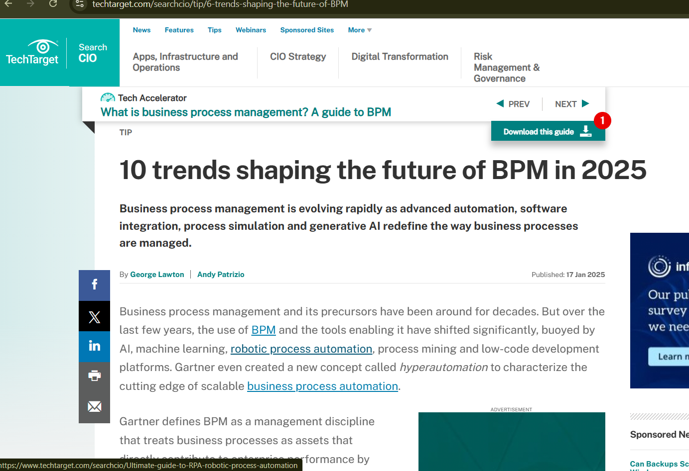
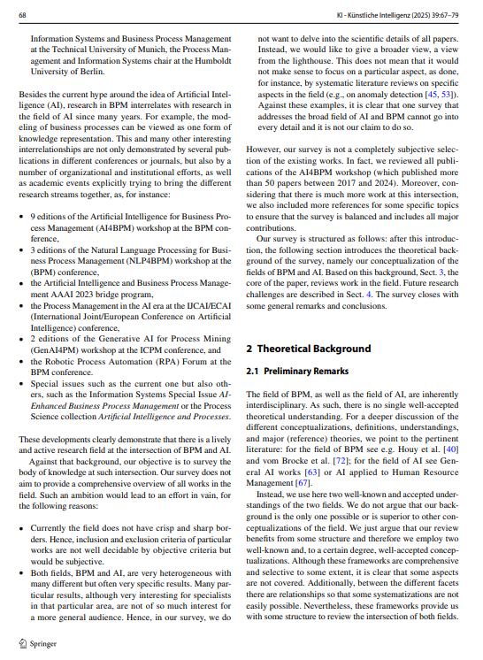
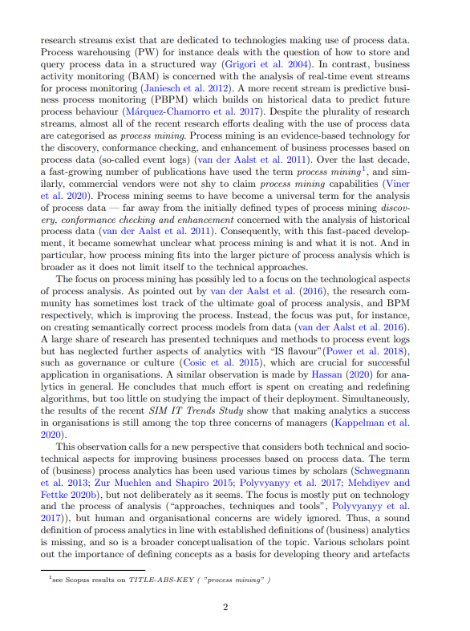

# COIT20252 – E-Portfolio 1: Process Analysis

## Artefact 1 – YouTube Video: What Is Process Analysis?

The video explains process analysis as a method to break down complex tasks into clear, structured steps, commonly used in manuals or instructional guides. It highlights that process analysis helps individuals understand how something works and allows replication of tasks through logical step-by-step instructions. The video emphasises clarity, audience consideration, and logical sequencing, which are crucial in both academic and professional contexts (The Language Library, 2025).  

I selected this artefact because it provides a simple introduction to process analysis. It helped me understand that breaking down tasks is essential in business environments, where processes need to be clear and consistent. The video demonstrates how structured thinking improves understanding and execution, which is a key aspect of analysing and improving business processes. It is meaningful as evidence of my understanding of BPM concepts in practice.

**Figure 1: Screenshot of Youtube video**

---

## Artefact 2 – Industry Article: 10 Trends Shaping the Future of BPM in 2025

The artefact explains how organisations increasingly use process mining and real-time analytics to analyse workflows, identify inefficiencies, and detect bottlenecks. The article highlights that continuous process analysis is critical for operational efficiency and supports digital transformation initiatives. It emphasises that process visibility and monitoring are now central to modern BPM practices (Lawton & Patrizio, 2025, p.1).  

I chose this artefact because it shows process analysis applied in real-world business contexts. It helped me understand that analysing processes is no longer a one-time task but a continuous, data-driven practice. This is important in BPM because organisations must adapt and improve their processes to remain competitive. The article demonstrates the practical value of process analysis, making it meaningful evidence of my understanding of BPM applications.

**Figure 2: Screenshot of Industry Article**

---

## Artefact 3 – Academic Article: Business Process Management and Artificial Intelligence

It explains how AI supports process analysis by enabling automation, predictive analytics, and pattern recognition in large datasets. The study highlights that AI enhances the accuracy and efficiency of analysing business processes, detecting inefficiencies, and suggesting improvements. It demonstrates how modern BPM is evolving to incorporate intelligent technologies for process optimisation (Fettke and Chiara Di Francescomarino., 2025, p.67-68).  

I selected this artefact because it illustrates advanced methods of process analysis using AI. It helped me realise that traditional analysis methods may be insufficient for complex workflows and large-scale data. In BPM, AI-driven analysis enables better decision-making and more efficient process improvements. The article is meaningful as it connects theoretical knowledge with innovative technology practices, showing how process analysis is evolving in modern business environments.

**Figure 3: Screenshot of Academic Article**

---

## Artefact 4 – Research Paper: Process Analytics – Data-Driven BPM

This artefact is a 2025 research paper on process analytics. It explains how organisations use event data from information systems to analyse real business processes, measuring performance and identifying inefficiencies. The study highlights that data-driven approaches provide more accurate insights than manual analysis and support workflow optimisation. Process analytics allows continuous improvement and evidence-based decision-making in BPM contexts (Stierle et al., 2025, p.2-3).  

I chose this artefact because it demonstrates advanced, practical process analysis using data. It helped me understand that process analysis is not just theoretical but relies on real measurements to improve operations. This is important in BPM because accurate insights enable effective decision-making and optimisation. The paper is meaningful evidence of my learning, showing how modern organisations implement process analysis to maintain efficient, high-performing business processes.

**Figure 4: Screenshot of Research Paper**

---

## References
Artefact 1: The Language Library (2025) *What Is Process Analysis?* Available at: [https://www.youtube.com/watch?v=bdsDBAJBGHE]

Artefact 2: Lawton, G. and Patrizio, A. (2025) *10 trends shaping the future of BPM*. Available at: [https://www.techtarget.com/searchcio/tip/6-trends-shaping-the-future-of-BPM]

Artefact 3: Fettke, P. and Chiara Di Francescomarino (2025). *Business Process Management and Artificial Intelligence*. KI - Künstliche Intelligenz. Available at: [https://link.springer.com/article/10.1007/s13218-025-00891-y#citeas] 

Artefact 4: Stierle, M., Kraume, K. and Matzner, M. (2025) *Process analytics – Data-driven business process management*. Available at: [https://arxiv.org/abs/2512.20703] 

---
## Figures
+ Figure 1: Screenshot of Youtube video.
+ Figure 2: Screenshot of Industry Article.
+ Figure 3: Screenshot of Academic Article.
+ Figure 4: Screenshot of Research Paper.
